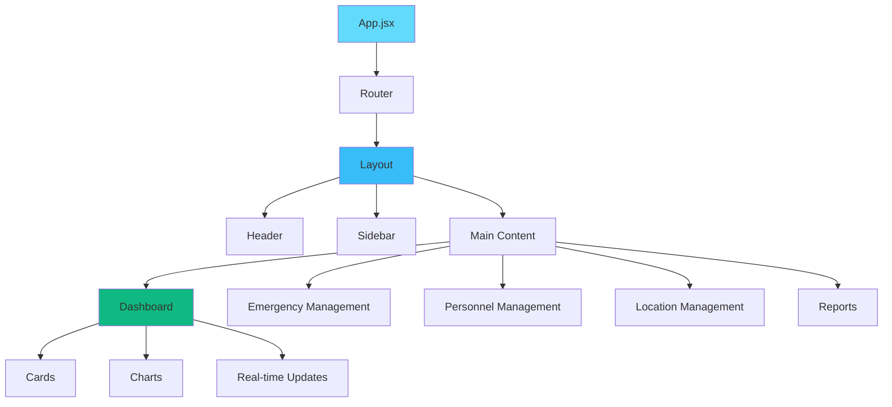
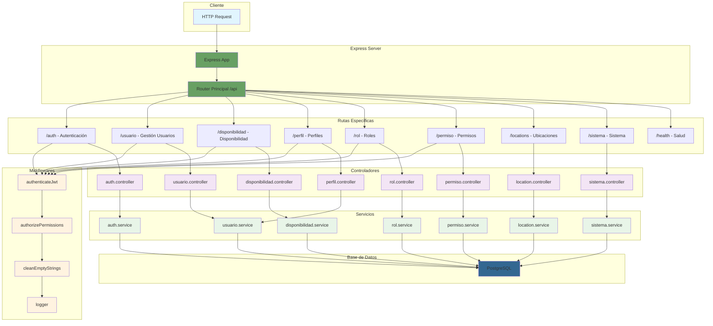

# Arquitectura del Sistema

Este documento describe la arquitectura completa del Sistema de Gestión Operativa para Bomberos, incluyendo su estructura, componentes y tecnologías implementadas.


## Estructura del Proyecto

El proyecto está organizado en una arquitectura modular que separa claramente las responsabilidades:

```
Bomberos/
├── backend/                 # API REST y lógica de negocio
│   ├── src/
│   │   ├── auth/            # Autenticación y autorización
│   │   ├── config/          # Configuraciones del sistema
│   │   ├── controllers/     # Controladores de rutas
│   │   ├── entities/        # Entidades de base de datos
│   │   ├── handlers/        # Manejadores de errores
│   │   ├── helpers/         # Funciones auxiliares
│   │   ├── middlewares/     # Middlewares de Express
│   │   ├── models/          # Modelos de datos
│   │   ├── routes/          # Definición de rutas
│   │   ├── services/        # Lógica de negocio
│   │   ├── sockets/         # WebSockets para tiempo real
│   │   └── validations/     # Validaciones de datos
│   ├── package.json
│   └── Dockerfile
├── frontend/                # Aplicación web React
│   ├── src/
│   │   ├── assets/          # Recursos estáticos
│   │   ├── components/      # Componentes reutilizables
│   │   ├── context/         # Context API de React
│   │   ├── helpers/         # Funciones auxiliares
│   │   ├── hooks/           # Custom hooks
│   │   ├── pages/           # Páginas de la aplicación
│   │   ├── services/        # Servicios de API
│   │   └── styles/          # Estilos globales
│   ├── package.json
│   └── Dockerfile
├── docs-site/               # Documentación con Docusaurus
└── docker-compose.yml       # Orquestación de contenedores
```

## Componentes del Frontend

El frontend está construido con **React 18** y utiliza tecnologías modernas:

### Tecnologías Principales

- **React 18**: Framework principal con Hooks y Context API
- **Vite**: Build tool para desarrollo rápido
- **Tailwind CSS**: Framework de estilos utilitarios
- **React Router**: Navegación del lado del cliente
- **Axios**: Cliente HTTP para comunicación con API

### Estructura de Componentes



### Componentes Principales

#### 1. **Dashboard**
- **Propósito**: Panel principal con métricas en tiempo real
- **Características**:
  - Tarjetas de estadísticas
  - Gráficos interactivos
  - Alertas y notificaciones
  - Actualizaciones en tiempo real vía WebSocket

#### 2. **Emergency Management**
- **Propósito**: Gestión de emergencias activas
- **Características**:
  - Lista de emergencias en curso
  - Formularios de creación/edición
  - Asignación de recursos
  - Seguimiento de estado

#### 3. **Personnel Management**
- **Propósito**: Administración de personal
- **Características**:
  - Gestión de bomberos
  - Control de disponibilidad
  - Asignación de roles
  - Historial de servicios

#### 4. **Location Management**
- **Propósito**: Gestión de ubicaciones y recursos
- **Características**:
  - Mapa interactivo
  - Gestión de estaciones
  - Inventario de equipos
  - Rutas optimizadas

### Patrones de Diseño Implementados

1. **Container/Presentational Pattern**: Separación entre lógica y presentación
2. **Custom Hooks**: Reutilización de lógica de estado
3. **Context API**: Gestión de estado global
4. **Higher-Order Components**: Funcionalidades transversales

## API REST

El backend implementa una **API RESTful** robusta con Node.js y Express.js:

### Arquitectura de la API

El flujo real de la API sigue esta estructura basada en el análisis del código:



### Endpoints Principales

Basado en la estructura real del backend, estos son los endpoints implementados:

#### **Autenticación** (`/api/auth`)
```
POST   /api/auth/login          # Iniciar sesión
POST   /api/auth/logout         # Cerrar sesión
GET    /api/auth/validate       # Validar token
```

#### **Usuarios** (`/api/usuario`)
```
GET    /api/usuario/            # Listar usuarios (requiere: usuario:leer_todos)
GET    /api/usuario/detail/     # Obtener usuario específico (requiere: usuario:leer_especifico)
POST   /api/usuario/            # Crear usuario (requiere: usuario:crear)
PATCH  /api/usuario/detail/     # Actualizar usuario (requiere: usuario:actualizar_especifico)
DELETE /api/usuario/detail/     # Eliminar usuario (requiere: usuario:eliminar)
PATCH  /api/usuario/status/:id  # Cambiar estado usuario (requiere: usuario:cambiar_estado)
```

#### **Disponibilidad** (`/api/disponibilidad`)
```
GET    /api/disponibilidad/                    # Listar disponibilidades (requiere: disponibilidad:read_all)
GET    /api/disponibilidad/detail/:id          # Obtener disponibilidad específica (requiere: disponibilidad:read_specific)
POST   /api/disponibilidad/                    # Crear disponibilidad (requiere: disponibilidad:create)
PATCH  /api/disponibilidad/detail/:id          # Actualizar disponibilidad (requiere: disponibilidad:update_specific)
DELETE /api/disponibilidad/detail/:id          # Eliminar disponibilidad (requiere: disponibilidad:delete)
GET    /api/disponibilidad/activa/:usuario_id  # Obtener disponibilidad activa (requiere: disponibilidad:read_specific)
PATCH  /api/disponibilidad/status              # Cambiar estado disponibilidad (requiere: disponibilidad:change_status)
```

#### **Perfiles** (`/api/perfil`)
```
GET    /api/perfil/             # Gestión de perfiles de usuario
POST   /api/perfil/             # Crear perfil
PATCH  /api/perfil/:id          # Actualizar perfil
DELETE /api/perfil/:id          # Eliminar perfil
```

#### **Roles** (`/api/rol`)
```
GET    /api/rol/                # Listar roles
POST   /api/rol/                # Crear rol
PATCH  /api/rol/:id             # Actualizar rol
DELETE /api/rol/:id             # Eliminar rol
```

#### **Permisos** (`/api/permiso`)
```
GET    /api/permiso/            # Listar permisos
POST   /api/permiso/            # Crear permiso
PATCH  /api/permiso/:id         # Actualizar permiso
DELETE /api/permiso/:id         # Eliminar permiso
```

#### **Ubicaciones** (`/api/locations`)
```
GET    /api/locations/          # Listar ubicaciones
GET    /api/locations/nearby    # Ubicaciones cercanas
GET    /api/locations/bounds    # Ubicaciones en área
POST   /api/locations/          # Crear ubicación
PATCH  /api/locations/:id       # Actualizar ubicación
DELETE /api/locations/:id       # Eliminar ubicación
```

#### **Sistema** (`/api/sistema`)
```
GET    /api/sistema/            # Configuración del sistema
POST   /api/sistema/            # Actualizar configuración
```

#### **Salud** (`/api/health`)
```
GET    /api/health/             # Estado de salud del sistema
```

### Características de la API

#### **Seguridad**
- **JWT Authentication**: Tokens seguros para autenticación
- **Role-Based Access Control (RBAC)**: Control de acceso por roles
- **Input Validation**: Validación exhaustiva de datos
- **Rate Limiting**: Protección contra ataques de fuerza bruta
- **CORS Configuration**: Configuración segura de CORS

#### **Validación de Datos**
```javascript
// Ejemplo de validación con Joi
const userSchema = Joi.object({
  name: Joi.string().min(2).max(50).required(),
  email: Joi.string().email().required(),
  role: Joi.string().valid('admin', 'firefighter', 'operator')
});
```

#### **Manejo de Errores**
- **Error Middleware**: Manejo centralizado de errores
- **HTTP Status Codes**: Códigos de estado apropiados
- **Error Logging**: Registro detallado de errores
- **User-Friendly Messages**: Mensajes claros para el usuario

#### **WebSocket Integration**
```javascript
// Eventos en tiempo real
io.on('connection', (socket) => {
  socket.on('emergency:created', (data) => {
    socket.broadcast.emit('emergency:update', data);
  });
  
  socket.on('availability:changed', (data) => {
    socket.to('dispatchers').emit('availability:update', data);
  });
});
```

### Base de Datos

El sistema utiliza **PostgreSQL** como base de datos principal:

#### **Entidades Principales**
- **Users**: Información de usuarios del sistema
- **Emergencies**: Registro de emergencias
- **Locations**: Ubicaciones y estaciones
- **Availability**: Disponibilidad del personal
- **Roles & Permissions**: Sistema de roles y permisos

#### **Diagramas de Base de Datos**

import ImageViewer from '@site/src/components/ImageViewer';

##### **Modelo Entidad-Relación (MER)**

<ImageViewer 
  src="/img/database/mer-diagram.png" 
  alt="Modelo Entidad-Relación del Sistema de Bomberos" 
  title="Modelo Entidad-Relación (MER) - Sistema de Gestión Operativa para Bomberos"
/>

##### **Modelo Relacional (MR)**

<ImageViewer 
  src="/img/database/mr-diagram.png" 
  alt="Modelo Relacional del Sistema de Bomberos" 
  title="Modelo Relacional (MR) - Esquema de Base de Datos PostgreSQL"
/>

:::tip Funcionalidades del Visor de Imágenes
- **Activar zoom**: Haz clic en la imagen para activar el modo zoom
- **Zoom manual**: Usa los botones +/- para hacer zoom una vez activado
- **Navegación**: Arrastra la imagen cuando esté ampliada para moverte
- **Resetear**: Haz clic nuevamente en la imagen ampliada para volver al tamaño original
- **Pantalla completa**: Usa el botón de pantalla completa para una mejor visualización
- **Atajos de teclado**: En pantalla completa usa +/- para zoom, 0 para resetear, ESC para salir
:::

## Tecnologías y Herramientas

### **Backend**
- **Node.js**: Runtime de JavaScript
- **Express.js**: Framework web
- **PostgreSQL**: Base de datos relacional
- **Redis**: Cache y sesiones
- **Socket.io**: WebSockets
- **JWT**: Autenticación
- **Joi**: Validación de datos
- **Winston**: Logging

### **Frontend**
- **React 18**: Framework de UI
- **Vite**: Build tool
- **Tailwind CSS**: Framework de estilos
- **React Router**: Enrutamiento
- **Axios**: Cliente HTTP
- **Chart.js**: Gráficos
- **React Hook Form**: Manejo de formularios

### **DevOps**
- **Docker**: Containerización
- **Docker Compose**: Orquestación local
- **GitHub Actions**: CI/CD
- **ESLint**: Linting de código
- **Prettier**: Formateo de código

## Referencia de la API

La API REST proporciona endpoints completos para todas las operaciones del sistema, implementando autenticación JWT, validación de datos y control de acceso basado en roles.

La documentación de la API incluye:
- Endpoints de autenticación y autorización
- Gestión de usuarios y permisos
- Operaciones de disponibilidad
- Configuración del sistema
- Gestión de ubicaciones
- Monitoreo de salud del sistema