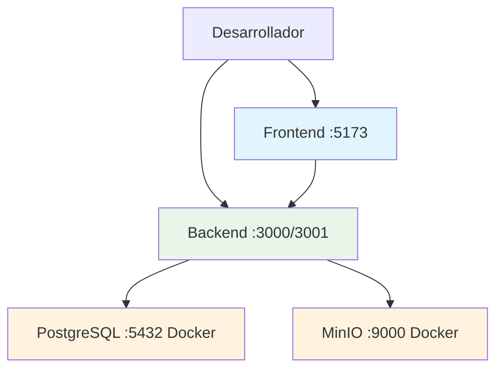

# Instalación para Desarrollo 💻

Esta guía te ayudará a configurar un entorno de desarrollo usando el `docker-compose.yml` existente. Puedes ejecutar todo en Docker o usar un enfoque híbrido con servicios en Docker y aplicaciones localmente.

## Prerrequisitos

Antes de comenzar, asegúrate de tener instalado:

- **Docker** y **Docker Compose**
- **Node.js** v18+ y **npm** (solo si ejecutas backend/frontend localmente)
- **Git** para clonar el repositorio
- Editor de código (VS Code recomendado)

## Configuración del Entorno

### 1. Clonar el Repositorio

```bash
git clone https://github.com/MarceloPazPezo/Bomberos.git
cd Bomberos
```

### 2. Configurar Variables de Entorno (Opcional)

El proyecto incluye valores por defecto en `docker-compose.yml`. Si quieres personalizar la configuración:

```bash
cp .env.example .env
```

Edita `.env` según tus necesidades:

```env
# --- CONFIGURACIÓN DEL BACKEND ---
B_HOST=localhost
B_PORT=3000
B_ACCESS_TOKEN_SECRET=your-super-secret-jwt-token-change-in-production
B_COOKIE_KEY=your-super-secret-cookie-key-change-in-production

# --- CONFIGURACIÓN DE BASE DE DATOS ---
DB_HOST=database
DB_NAME=db_bomberos
DB_PORT=5432
DB_USERNAME=user_bomberos
DB_PASSWORD=password_bomberos

# --- CONFIGURACIÓN DE MINIO ---
MINIO_ENDPOINT=minio
MINIO_PORT=9000
MINIO_USE_SSL=false
MINIO_ACCESS_KEY=admin_bomberos
MINIO_SECRET_KEY=password_bomberos123
MINIO_BUCKET_NAME=uploads

# --- PUERTOS EXTERNOS ---
EXTERNAL_BACKEND_PORT=3000
EXTERNAL_FRONTEND_PORT=80
EXTERNAL_DB_PORT=5432
EXTERNAL_MINIO_PORT=9000
EXTERNAL_MINIO_CONSOLE_PORT=9002

# --- ENTORNO ---
NODE_ENV=development
```

## Opciones de Desarrollo

### Desarrollo Híbrido (Recomendado)

Esta opción te permite desarrollar con mayor flexibilidad:

1. **Servicios en Docker** (Base de datos y MinIO)
2. **Aplicaciones locales** (Backend y Frontend para desarrollo)

#### Configuración de Puertos Flexible

- **Solo servicios Docker (DB + MinIO)**: Backend local usa puerto **3000**
- **Backend también en Docker**: Backend local usa puerto **3001** para evitar conflictos

Para desarrollo activo con hot-reload, ejecuta solo los servicios en Docker:

```bash
# Levantar solo base de datos y MinIO
docker-compose up database minio -d

# Verificar servicios
docker-compose ps
```

**Servicios disponibles:**
- **PostgreSQL:** localhost:5432
- **MinIO:** localhost:9000
- **MinIO Console:** localhost:9002

## Configuración del Backend (Local)

### 1. Configurar Variables de Entorno del Backend

```bash
cd backend
cp .env.development.example .env.development
```

Edita `backend/.env.development` para conectar con los servicios Docker:

```env
# Puerto del servidor
PORT=3000
# Nota: Si tienes el backend de Docker corriendo, cambia a PORT=3001

# Base de datos (Docker en puerto 5432)
DB_HOST=localhost
DB_PORT=5432
DATABASE=db_bomberos
DB_USERNAME=user_bomberos
PASSWORD=password_bomberos

# MinIO (Docker en puerto 9000)
MINIO_ENDPOINT=localhost
MINIO_PORT=9000
MINIO_USE_SSL=false
MINIO_ACCESS_KEY=admin_bomberos
MINIO_SECRET_KEY=password_bomberos123
MINIO_BUCKET_NAME=uploads

# Seguridad
ACCESS_TOKEN_SECRET=your-super-secret-jwt-token-change-in-production
COOKIE_KEY=your-super-secret-cookie-key-change-in-production

# Entorno
NODE_ENV=development
```

### 2. Instalar Dependencias

```bash
npm install
```

### 3. Ejecutar en Modo Desarrollo

```bash
# Iniciar servidor con hot-reload
npm run dev

# El backend estará disponible en http://localhost:3000
# (o en puerto 3001 si el backend de Docker está corriendo)
```

## Configuración del Frontend (Local)

### 1. Instalar Dependencias

```bash
cd frontend
npm install
```

### 2. Ejecutar en Modo Desarrollo

```bash
# Iniciar servidor de desarrollo
npm run dev

# El frontend estará disponible en http://localhost:5173
```

## Flujo de Desarrollo

### Estructura de Desarrollo


## Comandos Útiles

### Base de Datos

```bash
# Conectar a PostgreSQL
psql -h localhost -p 5432 -U user_bomberos -d db_bomberos
```

```bash
# Backup de la base de datos
pg_dump -h localhost -p 5432 -U user_bomberos db_bomberos > backup.sql
```

### MinIO

**Acceso MinIO Console:**
- URL: http://localhost:9002
- Usuario: `admin_bomberos`
- Contraseña: `password_bomberos123`

## Solución de Problemas

- **Puerto 3000 ocupado:** Cambiar `EXTERNAL_BACKEND_PORT` en `.env`

## Próximos Pasos

1. 📖 Familiarízate con la [Arquitectura del Sistema](../arquitectura)

¿Necesitas ayuda? 💬 [Contacta al equipo de desarrollo](mailto:dev@bomberos.cl)